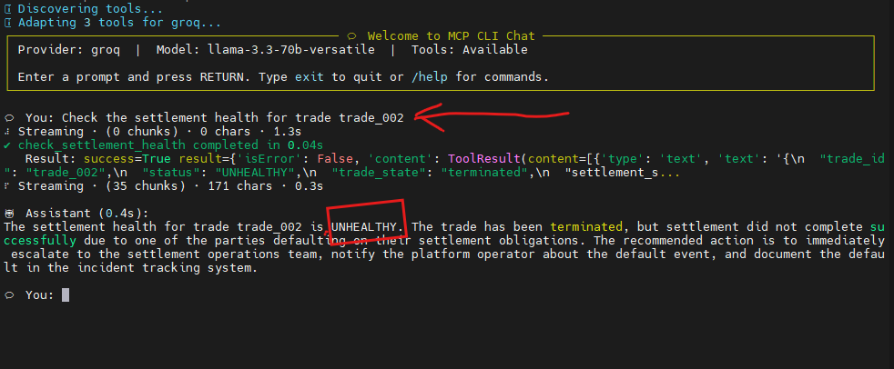
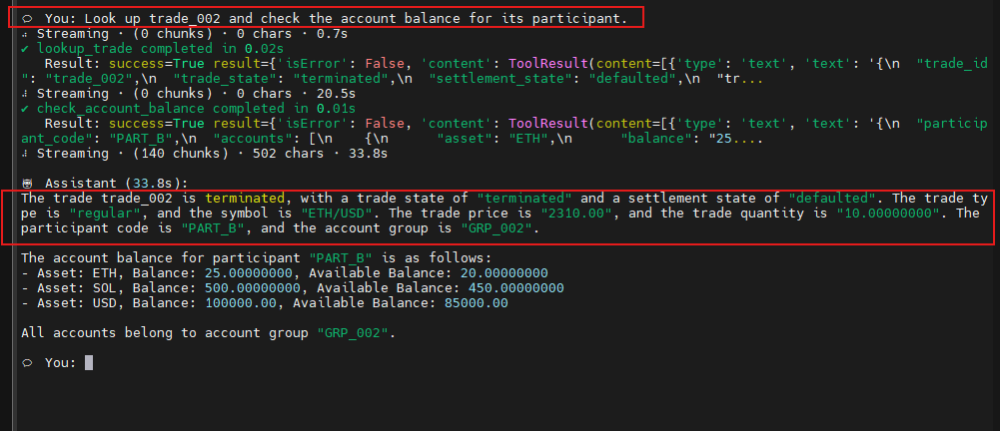
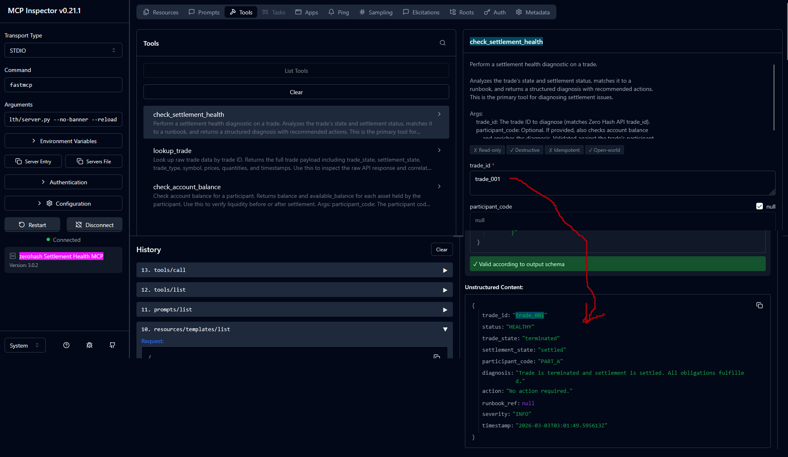
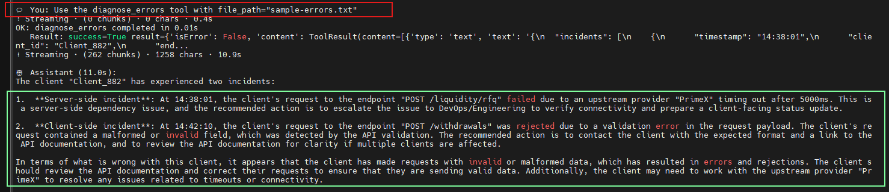

# zerohash Settlement Health MCP

This is an MCP server for the command line. It takes a **trade\_id**, queries the (mocked) Zero Hash API, and performs a *pre-flight* or a *post-mortem* check. It shows the JSON response, and maps the trade state to a Runbook, <strong>example:</strong> "Trade defaulted. Action: Escalate to the settlement operations team and file an incident report."

 The MCP server encodes zerohash's settlement logic and API runbooks. A technical support engineer (TSE) can diagnose 'Trade & Transact' issues in seconds, directly in the terminal where they are already viewing logs. Using [mcp-cli](https://github.com/IBM/mcp-cli) for interactive LLM-powered chat, or `fastmcp` for instant tool invocation with no setup required. 
 
 | mcp-cli: <br>*Check trade_002* | mcp-cli: <br>*Check trade_002+* | Non-LLM trade_id query <br> and piped query | uv run fastmcp <br>dev inspector | mcp-cli: <br>Check these logs: |
| :---: | :---: | :---: | :---: | :---: |
| <kbd></kbd> | <kbd></kbd>  | <kbd></kbd> | <kbd></kbd> | <kbd></kbd> |

Advantages:

* **Context is king:** TSEs shouldn't have to leave the terminal/command line to diagnose a [Settlement](https://zerohash.com/) failure. The tool lives where the logs are, allowing the TSE to pipe an error directly into a tool that interprets the zerohash settlement logic and suggests an action.
* **Bridging the gap:** The tool moves the user from API documentation that is "somewhere", to "Docs as Action". The TSE gets a tool that validates a *state* against those docs and suggests an *action*.
* **Direct tool execution:** `fastmcp call ... --target check_settlement_health trade_id=trade_002` – a one-liner that returns a structured diagnosis. Mimics interaction with a troubleshooting script during a prod incident.
* **Chat for complex analysis:** Switch to `mcp-cli chat` for multi-step analysis: "Check settlement health for trade\_005 and then verify the participant's account balance" – the AI chains the applicable MCP tools and returns a unified answer.
* **Multi-provider support:** `mcp-cli` supports Groq, Gemini, OpenAI, Anthropic, and Ollama – not locked into one model.

## Setup

Requires: Python 3.11+, [uv](https://docs.astral.sh/uv/)

```bash
git clone https://github.com/V-You/zerohash-settlement-health-mcp
cd zerohash-settlement-health-mcp
uv sync --extra dev

# ~100 MB
```

For LLM chat mode (`mcp-cli`), also install the `chat` extra:

```bash
uv sync --extra dev --extra chat

# ~400 MB
```

## Usage

### Direct tool calls (no LLM)

```bash
# List available tools
uv run fastmcp list src/zerohash_settlement_health/server.py

# Call a tool – returns structured JSON diagnosis
uv run fastmcp call src/zerohash_settlement_health/server.py --target check_settlement_health trade_id=trade_002

# Call a tool – returns structured prettified JSON diagnosis
uv run fastmcp call src/zerohash_settlement_health/server.py --target check_settlement_health trade_id=trade_002 2>/dev/null | jq -r '.result' | jq .

# (Optional) Launch the web-based MCP Inspector
# Then, in the web browser, "Connect" to server and: 
# Tools (top) → check_settlement_health → enter trade_id → Run Tool
uv run fastmcp dev inspector src/zerohash_settlement_health/server.py

```

### LLM chat (mcp-cli)

```bash
# Copy .env to project folder
# Export API keys from .env into the current shell session
set -a; source .env; set +a

# Start interactive chat
uv run --with mcp-cli mcp-cli chat --config-file server_config.json --server zerohash-settlement-health --provider groq
```

Example queries:
- "Check the settlement health for trade trade_002"
- "Look up trade_005 and check the account balance for its participant"

Supported providers: groq, gemini, openai, anthropic, ollama. **Keys:** Add GROQ_API_KEY or OPENROUTER_API_KEY to the `.env` file. Run `set -a; source .env; set +a` once per shell session (.env file is not auto-loaded).

**Mock trade IDs:** 
- `trade_001` (healthy)
- `trade_002` (defaulted/CRITICAL)
- `trade_003` (counterparty default)
- `trade_004`–`trade_008` (various states)

## Workflow notes

**Execution:** The CLI client sends a `call_tool` request to the server process. The server queries the Zero Hash API (or mock), maps the trade state to a runbook (also currently mocked but not implausible), and returns a structured diagnosis to the terminal. 

---

## Tools

- **check_settlement_health** – You send a `trade_id`, the tool queries the Zero Hash API, maps the trade state to a runbook, and returns a structured diagnosis to you, including next steps.
- **lookup_trade** – You send a `trade_id`, the tool returns trade details: state, timestamps, participants, amounts.
- **check_account_balance** – You send a participant, the tool fetches account balances, enriched with live market prices (`price_usd`, `value_usd`).
- **get_market_prices** – Fetches live crypto prices from CoinGecko (BTC, ETH, SOL by default). Also enriches the other tools.
- **diagnose_errors** – You provide API error logs, the tool parses the logs and groups entries into incidents, classifies each as `CLIENT_SIDE`/`SERVER_SIDE`/`UNKNOWN`, matches them to runbooks (next steps), and generates draft client responses.

### Market prices

The `get_market_prices` tool fetches [live crypto prices from CoinGecko](https://www.coingecko.com/en/api) (free tier, no key): BTC, ETH, SOL. 

**Price enrichment:** The existing `check_account_balance` and `check_settlement_health` tools are automatically enriched with live market data. Account balances show `price_usd` and `value_usd` fields; health checks include a `market_context` comparing the trade price to the current market price.

**Error logging:** Set `MARKET_PRICE_ERROR_LOG=true` in `.env` to record CoinGecko API errors (with timestamps) to `market_errors.log`. This lets other tools or a TSE detect API downtime patterns. Disabled by default.


#### Direct call (no LLM)

```bash
# Get current prices for BTC, ETH, SOL
uv run fastmcp call src/zerohash_settlement_health/server.py --target get_market_prices

# Single asset
uv run fastmcp call src/zerohash_settlement_health/server.py --target get_market_prices assets=BTC

# Custom set
uv run fastmcp call src/zerohash_settlement_health/server.py --target get_market_prices assets=BTC,ETH,DOGE,SOL
```

#### LLM chat (mcp-cli)

- "What are the current prices for BTC, ETH, and SOL?"
- "Check settlement health for trade_002 and show me the current market prices"


### Diagnose errors

The `diagnose_errors` tool parses API error logs in `[HH:MM:SS] LEVEL: message` format. It groups log entries into incidents by `(client_id, endpoint)`, classifies each as client-side (4xx) or server-side (5xx), matches a runbook (e.g. `upstream_timeout`, `rate_limit`, `auth_failure`), and returns a structured diagnosis with attribution, remediation steps, and a draft client response.

Accepts `log_text` (pasted/piped) or `file_path` (relative path to a `.log`/`.txt` file), or both.

#### Direct call (no LLM)

```bash
# Pipe log text directly
uv run fastmcp call src/zerohash_settlement_health/server.py --target diagnose_errors \
  log_text='[14:38:01] ERROR: Upstream timeout from PrimeX for Client_882 on POST /liquidity/rfq'

# Point to a log file (relative path)
uv run fastmcp call src/zerohash_settlement_health/server.py --target diagnose_errors \
  file_path=errors.log
```

#### LLM chat (mcp-cli)

- "Diagnose these errors: [14:38:01] ERROR: Upstream timeout from PrimeX ..."
- "Parse the log file errors.log and tell me what happened"

---

## Future

- Tool: **get_market_prices:**
  - Symbol mapping: Fallback to CoinGecko's `/search` to support more asset symbols.  
  - Rate limiting / caching: CoinGecko allows ~30/min. Add 30s in-memory TTL cache (as chat-mode may hit limit).  
  - Error log rotation: `market_errors.log` is append-only. Add rotation.  
  - CoinGecko Pro tier: If needed, add `COINGECKO_API_KEY` to `.env`, send `x-cg-demo-api-key` header.  