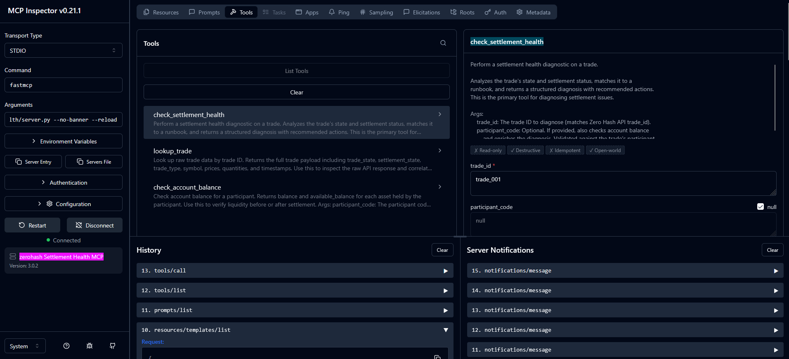
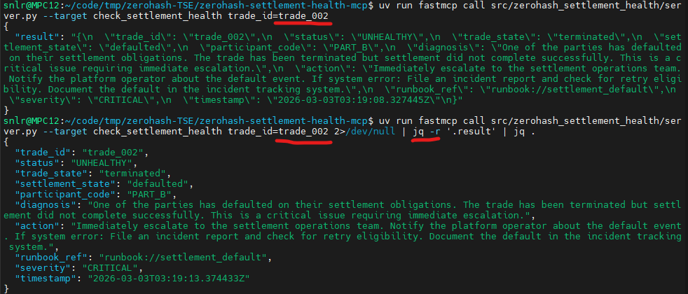
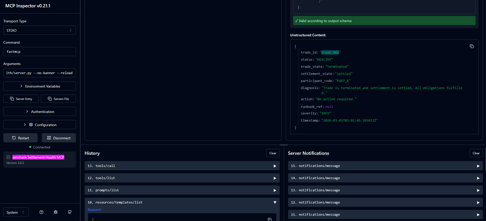

# zerohash Settlement Health MCP

This is an MCP server for the command line. It takes a **trade\_id**, queries the (mocked) Zero Hash API, and performs a *pre-flight* or a *post-mortem* check. It shows the JSON response, and maps the trade state to a Runbook. Example: "Trade defaulted. Action: Escalate to the settlement operations team and file an incident report. 

| `./zh`  | Non-LLM Trade ID query <br> and pretty query | uv run fastmcp <br>dev inspector  |
| :---: | :----: | :----: |
| <kbd></kbd> | <kbd></kbd> | <kbd></kbd><br><kbd></kbd> | 

The MCP server encodes zerohash's settlement logic and API runbooks. A technical support engineer (TSE) can diagnose 'Trade & Transact' issues in seconds, directly in the terminal where they are already viewing logs. Using [mcp-cli](https://github.com/IBM/mcp-cli) for interactive LLM-powered chat, or `fastmcp` for instant tool invocation with no setup required. Advantages:

* **Context is king:** TSEs shouldn't have to leave the terminal/command line to diagnose a [Settlement](https://zerohash.com/) failure. The tool lives where the logs are, allowing the TSE to pipe an error directly into a tool that interprets the zerohash settlement logic and suggests an action.
* **Bridging the gap:** The tool moves the user from API docs that are "somewhere", to "Docs as Action". The TSE gets a tool that validates an API state against those docs.
* **Direct tool execution:** `fastmcp call ... --target check_settlement_health trade_id=trade_002` — a one-liner that returns a structured diagnosis. Mimics interaction with a troubleshooting script during a prod incident.
* **Chat for complex analysis:** Switch to `mcp-cli chat` for multi-step analysis: "Check settlement health for trade\_005 and then verify the participant's account balance" — the AI chains the applicable MCP tools and returns a unified answer.
* **Multi-provider support:** `mcp-cli` supports Groq, Gemini, OpenAI, Anthropic, and Ollama — not locked into one model.

# Setup

Requires: Python 3.11+, [uv](https://docs.astral.sh/uv/)

```bash
git clone https://github.com/V-You/zerohash-settlement-health-mcp
cd zerohash-settlement-health-mcp
uv sync --extra dev
```

# Usage

## Direct tool calls (no LLM)

```bash
# List available tools
uv run fastmcp list src/zerohash_settlement_health/server.py

# Call a tool — returns structured JSON diagnosis
uv run fastmcp call src/zerohash_settlement_health/server.py --target check_settlement_health trade_id=trade_002

# Call a tool — returns structured prettified JSON diagnosis
uv run fastmcp call src/zerohash_settlement_health/server.py --target check_settlement_health trade_id=trade_002 2>/dev/null | jq -r '.result' | jq .

# (Optional) Launch the web-based MCP Inspector
# Then, in the web browser, "Connect" to server and: 
# Tools (top) → check_settlement_health → enter trade_id → Run Tool
uv run fastmcp dev inspector src/zerohash_settlement_health/server.py

```

## LLM chat (mcp-cli)

```bash
# Export API keys from .env into the current shell session
set -a; source .env; set +a

# Start interactive chat
uv run mcp-cli chat --config-file server_config.json --server zerohash-settlement-health --provider groq
```

Example queries:
- "Check the settlement health for trade trade\_002"
- "Look up trade\_005 and check the account balance for its participant"

Supported providers: groq, gemini, openai, anthropic, ollama. **Keys:** Add GROQ_API_KEY or OPENROUTER_API_KEY to the `.env` file. Run `set -a; source .env; set +a` once per shell session. The `mcp-cli` command does not auto-load `.env`.

**Mock trade IDs:** 
- `trade_001` (healthy)
- `trade_002` (defaulted/CRITICAL)
- `trade_003` (counterparty default)
- `trade_004`–`trade_008` (various states)


# Workflow

**Execution:** The CLI client sends a `call_tool` request to the server process. The server queries the Zero Hash API (or mock), maps the trade state to a runbook, and returns a structured diagnosis to the terminal. 